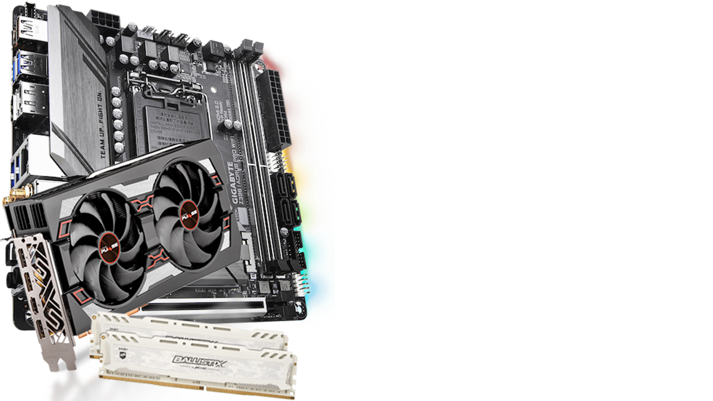
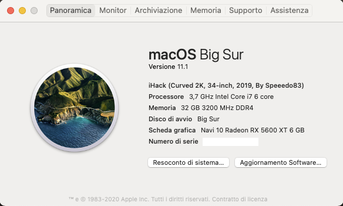
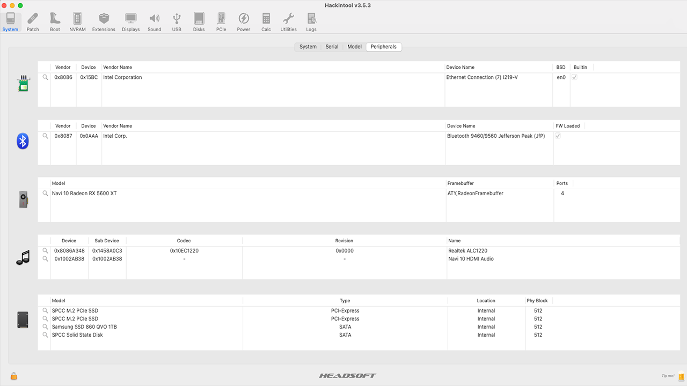
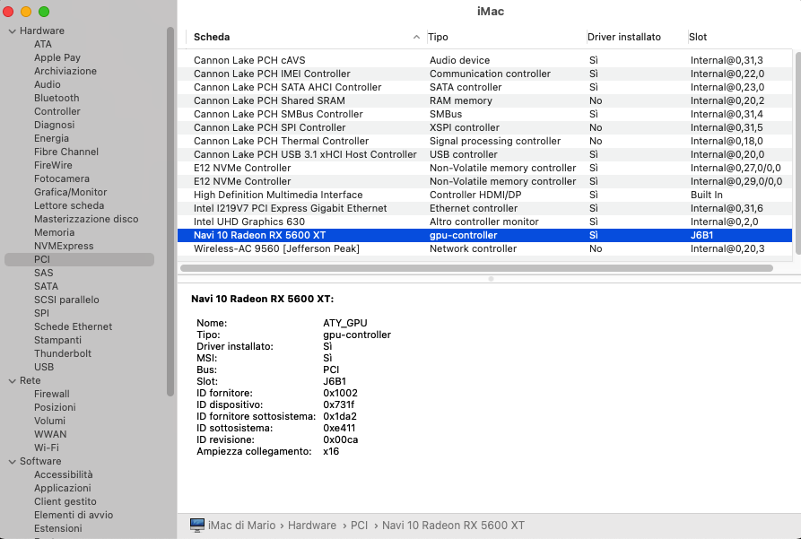
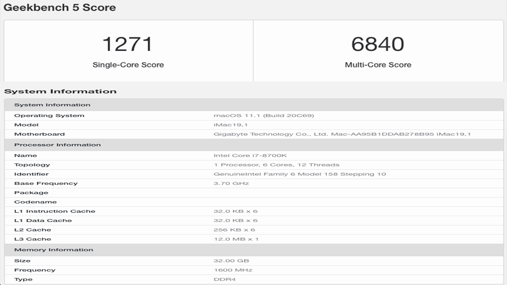
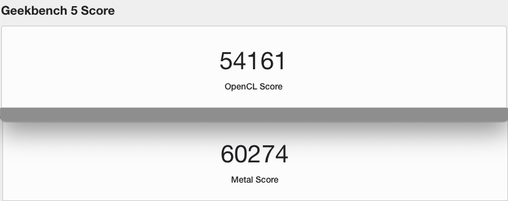
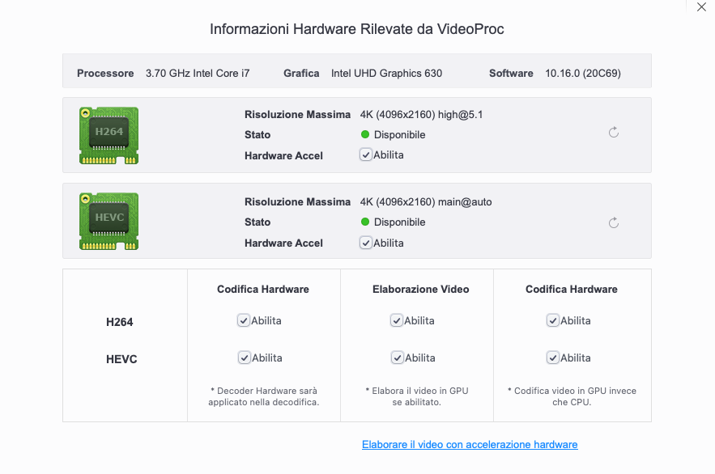

# Z390i Aourus WiFi(ac) + Intel I7 8700K + 32G DDR4 3200 Mhz + RX 5600xt Sapphire

EFI Z390i Aourus WiFi(ac) + Intel I7 8700K with OpenCore bootloader

### Computer Spec:

| Component        | Brank                              |
| ---------------- | ---------------------------------- |
| CPU              | Intel i7 8700K (6C-12T 12MB)       |
| iGPU             | Intel® Graphics UHD 630            |
| Audio            | Realtek ALC1220                    |
| Ram              | 32 GB DDR4 3200 Mhz                |
| Wifi + Bluetooth | Intel CNVi interface ac            |
| Lan              | Intel I219-V GbE                   |
| NVMe             | SPCC Silicon Power 512G ( MacOS)   |
| SSD Sata         | Samsung SSD QVO  1TB (Mac Storage) |
| NVMe             | SPCC Silicon Power 512G (Windows)  |
| SSD Sata         | SPCC Silicon Power 1TB (WinStorage)|
| SmBios           | iMac 19,1                          |
| BootLoader       | OpenCore 0.6.5                     |
| macOS            | Big Sur 11.1                       |

## Modded GUI Opencore (0.6.5) by HakintoshLife

### What works and What doesn't or WIP:

- [x] CFG Unlock
- [x] Intel Graphics UHD iGPU (use for task only)
- [x] ALC1220 All jack activate
- [x] ALC1220 Combo jack external
- [x] All USB-A 3.1 Ports (TYPE-C incluse)
- [x] SpeedStep / Sleep / Wake
- [x] HID Key PWRB & SLPB 
- [x] Wi-Fi and Bluetooth Intel work with OpenIntelWireless/itlwm
- [x] Controller SATA III
- [x] Controller NVME PciE Gen3x4 
- [x] All Sensors CPU, IGPU, BATTERY, NVME, SATA, FAN
- [x] Apple VTD
- [x] NVRAM
- [x] Recovery (macOS) boot from OpenCore
- [x] Windows 10 boot from OpenCore

## Peripherals & Benchmarks

### Special Config:/Users/mario/Desktop/image

- Usb port mapping performed
- SSDT-Hack Essential patch
- Applied cosmetics PCI Dev

See [ioreg](https://github.com/Speeedo83/Gigabyte-Z390i-Aourus-WiFi-i7-8700k-Hackintosh/blob/main/iMac%20di%20Mario.ioreg) for more clarification

### MacOS bootable USB creation:
- Read the Dortania guide for creating your USB from Windows or macOS
- [Guide Dortania](https://dortania.github.io/OpenCore-Install-Guide/installer-guide/) - USB creation

## Bios settings
* Load Optimized Defaults
* CFG set to Unlock ( bios version F8i )
* M.I.T. -> Advanced Memory Settings Extreme Memory Profile (X.M.P.) : Profile_1 oppure Auto
* BIOS -> Fast Boot : Disabled
* BIOS -> CSM : Disabled
* BIOS -> LAN PXE Boot Option ROM : Disabled
* BIOS -> Storage Boot Option Control : UEFI
* Peripherals -> Trusted Computing -> Security Device Support : Disable
* Peripherals -> Network Stack Configuration -> Network Stack : Disabled
* Peripherals -> USB Configuration -> Legacy USB Support : Auto
* Peripherals -> USB Configuration -> XHCI Hand-off : Enabled
* Chipset -> Vt-d : Disabled
* Chipset -> Wake on LAN Enable : Disabled
* Chipset -> IOAPIC 24-119 Entries : Enabled
* DVTM -> Set to 64 or 128 for Monitor > fullHD
* Aperture Size iGPU -> Set to MAX

NB: con schede video AMD il CSM deve essere su Disable per tutte le marche di schede madri

 

## Credits

- [Apple](https://apple.com) for macOS.
- [Acidanthera](https://github.com/acidanthera) for OpenCore and all the lovely hackintosh work.
- [Dortania](https://dortania.github.io/OpenCore-Install-Guide/config-laptop.plist/icelake.html) For great and detailed guides.
- [Hackintoshlifeit](https://github.com/Hackintoshlifeit) Support group for installation and post installation.

# If you need help please contact us on [Telegram](https://t.me/HackintoshLife_it) or [Web](https://www.hackintoshlife.it/)
